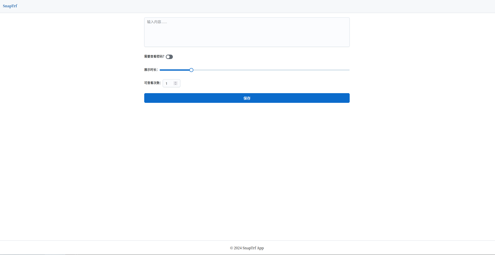
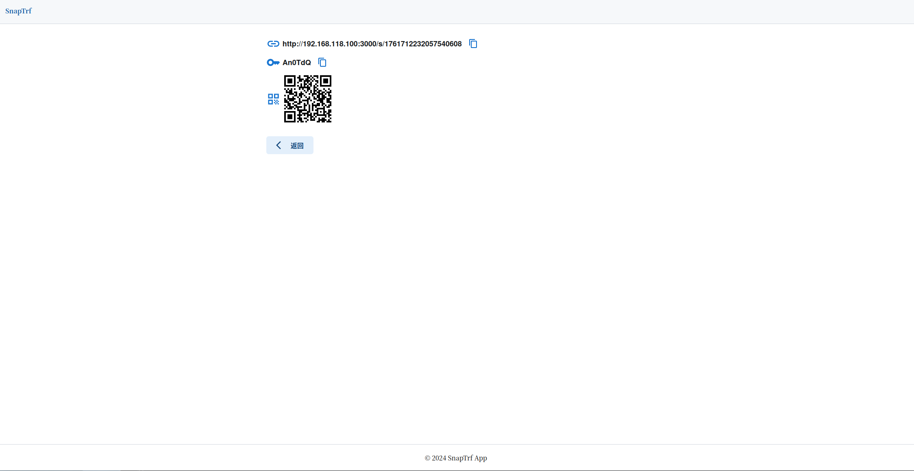
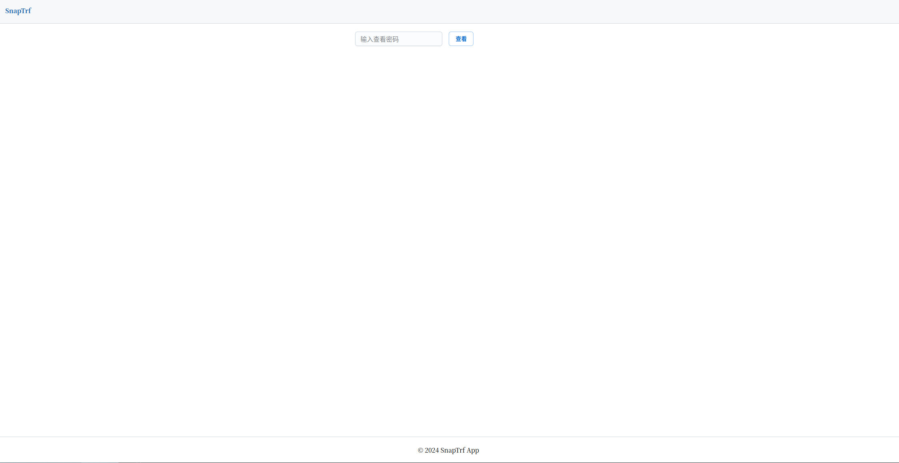

# 阅后即焚web应用

## 功能列表

- 最长268个字符，数据最长保留24小时
- 支持设置密码查看
- 支持设置展示时长，超过时间自动删除
- 支持设置可查看次数
- 生成的消息结果支持一键复制
- 生成的消息链接支持生成二维码

## 部署

### 前端

进入web目录，安装`node`依赖，修改`config.js`里面的`host`和`apiHost`配置。

开发模式运行：

````shell
npm run dev
````

发布编译：

```shell
npm run build
```

发布运行：

```shell
npm run start
```

更多细节请参考`netx.js`官方的应用部署文档。

### 后端

配置在`config/config.toml`文件

运行`go run ./cmd httpd`或

编译：

````shell
go build -o snaptrf ./cmd/
````
运行web服务：

配置文件目录`config`和二进制文件同目录。

```shell
./snaptrf httpd
```

## 技术栈

前端：

- javascript
- next.js
- react

后端：

- go

存储：

- redis

> redis版本需要7.0及以上


## 截图




