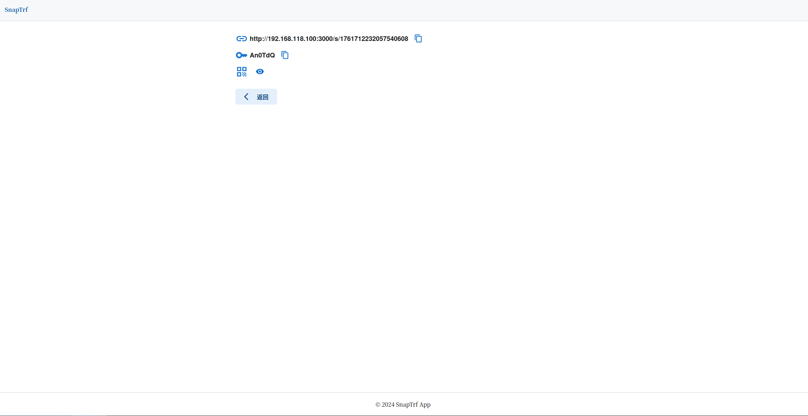

# 阅后即焚web应用

## 功能列表

- 数据最长保留24小时
- 支持设置密码查看
- 支持设置展示时长，超过时间自动删除
- 支持设置可查看次数
- 生成的消息结果支持一键复制
- 生成的消息链接支持生成二维码

## 部署

### docker部署

1. 修改配置
    - redis连接`deploy/.env`
    - 后端配置`config/config.toml`, redis配置优先使用`.env`里面的
    - 前端域名和接口地址配置 `web/.env`
    - 修改服务对外端口 `deploy/docker-compose.yml`，修改宿主机端口映射
2. 构建镜像并运行：`make`
3. 清理文件：`make clean`

> 默认是podman。
> 
> 如果是docker，请修改makefile中的`podman`为`docker`，`podman-compose`为`docker compose`。

### 手动运行

#### 前端

进入web目录，`npm install`安装依赖，配置在`.env`文件。

开发模式运行：

````shell
npm run dev
````

发布编译：

```shell
npm run build
```

发布运行：

```shell
npm run start
```

更多细节请参考`netx.js`官方的应用部署文档。

#### 后端

配置在`config/config.toml`文件

运行`go run ./cmd httpd`或

编译：

````shell
go build -o snaptrf ./cmd/
````
运行web服务：

配置文件目录`config`和二进制文件同目录。

```shell
./snaptrf httpd
```

## 技术栈

前端：

- javascript
- next.js
- react

后端：

- go

存储：

- redis

> redis版本需要7.0及以上


## 截图




